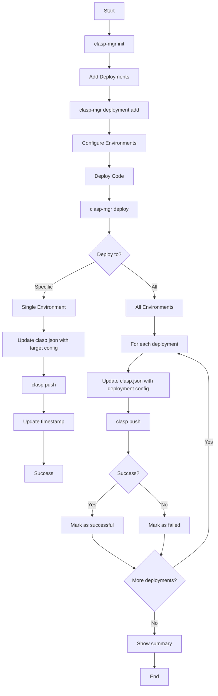

# clasp-mgr

A self-contained shell script for managing multiple Google Apps Script (GAS) deployments. Deploy your code to different environments (development, staging, production) with a single command.

## Overview

`clasp-mgr` simplifies the management of multiple Google Apps Script deployments by providing a unified interface to deploy to different environments. Instead of manually switching between different `clasp.json` configurations, you can manage all your deployments in one place and deploy with a single command.

### Key Features

- 🚀 **Multi-environment deployment** - Deploy to development, staging, production, or all at once
- 📁 **Project management** - Initialize and manage GAS projects with different container types
- 🔧 **Zero dependencies** - Pure bash script with no external dependencies beyond `clasp`
- 📊 **Deployment tracking** - Track last deployment timestamps for each environment
- 🎯 **Interactive mode** - User-friendly prompts for easy setup and deployment
- ⚡ **Fast deployment** - Deploy to multiple environments with a single command

## Prerequisites

- [Google Apps Script CLI (clasp)](https://github.com/google/clasp) installed globally
- Bash shell (macOS, Linux, or WSL on Windows)
- Google Apps Script project(s) already created

### Install clasp

```bash
npm install -g @google/clasp
```

## Installation

1. Download the script:
```bash
curl -O https://raw.githubusercontent.com/yourusername/clasp-mgr/main/shell/clasp-mgr
chmod +x clasp-mgr
```

2. Move to your PATH (optional):
```bash
sudo mv clasp-mgr /usr/local/bin/
```

## Quick Start

### 1. Initialize a Project

Navigate to your Google Apps Script project directory and initialize clasp-mgr:

```bash
clasp-mgr init
```

This will:
- Detect your existing `clasp.json` configuration
- Create a `.clasp_mgr/clasp-mgr.json` configuration file
- Set up project metadata (name, container type)

### 2. Add Deployments

Add your different environments:

```bash
# Add production deployment
clasp-mgr deployment add --name "Production" --script-id "ABC123xyz"

# Add staging deployment  
clasp-mgr deployment add --name "Staging" --script-id "DEF456abc"

# Add development deployment
clasp-mgr deployment add --name "Development" --script-id "GHI789def"
```

### 3. Deploy

Deploy to specific environments or all at once:

```bash
# Deploy to specific environment
clasp-mgr deploy "Production"

# Deploy to all environments
clasp-mgr deploy all

# Interactive deployment (choose from list)
clasp-mgr deploy
```

**How Deploy All Works:**
The `deploy all` command sequentially processes each deployment:

1. **Loops through each deployment** in your configuration
2. **For each deployment**:
   - Updates `.clasp.json` with that deployment's `scriptId` and `rootDir`
   - Runs `clasp push` to deploy your code to that Google Apps Script project
   - Records success/failure status
3. **Continues to next deployment** even if one fails
4. **Shows summary** of all successful and failed deployments

This means your local `.clasp.json` file gets temporarily updated for each deployment, allowing clasp to push to the correct Google Apps Script project.

## Configuration

### Project Structure

```
your-gas-project/
├── .clasp.json                    # Standard clasp configuration
├── .clasp_mgr/
│   └── clasp-mgr.json            # clasp-mgr configuration
├── Code.gs                       # Your GAS code
└── appsscript.json              # GAS manifest
```

### Configuration File Format

The `.clasp_mgr/clasp-mgr.json` file stores your deployment configurations:

```json
{
  "project_name": "My GAS Project",
  "type": "google-apps-script",
  "container_type": "Standalone",
  "deployments": [
    {
      "deployment_name": "Production",
      "clasp_scriptId": "ABC123xyz",
      "clasp_rootDir": ".",
      "last_deployed": "2024-01-15T10:30:00Z"
    },
    {
      "deployment_name": "Staging",
      "clasp_scriptId": "DEF456abc",
      "clasp_rootDir": ".",
      "last_deployed": null
    }
  ]
}
```

## Commands

### `clasp-mgr init`

Initialize clasp-mgr for your current project.

**Options:**
- `--project-name <name>` - Set project name (non-interactive)
- `--container-type <type>` - Set container type (non-interactive)

**Container Types:**
- Standalone
- Spreadsheet
- Document
- Form
- Slides
- Webapp

**Example:**
```bash
clasp-mgr init --project-name "My API" --container-type "Webapp"
```

### `clasp-mgr deployment add`

Add a new deployment configuration.

**Options:**
- `--name <name>` - Deployment name
- `--script-id <id>` - Google Apps Script ID

**Example:**
```bash
clasp-mgr deployment add --name "Production" --script-id "1ABC123xyz"
```

### `clasp-mgr deployment list`

List all configured deployments with their status.

**Example:**
```bash
clasp-mgr deployment list
```

**Output:**
```
Configured Deployments:
=======================

1. Production (ACTIVE)
   Script ID: 1ABC123xyz
   Root Dir: .
   Last Deployed: 2024-01-15T10:30:00Z

2. Staging
   Script ID: 1DEF456abc
   Root Dir: .
   Last Deployed: Never
```

### `clasp-mgr deploy`

Deploy to specific environment or all environments.

**Arguments:**
- `[deployment_name]` - Name of deployment to deploy to
- `all` - Deploy to all configured environments

**How it works:**
- **Single deployment**: Updates `.clasp.json` with the target deployment's configuration, then runs `clasp push`
- **Deploy all**: Loops through each deployment, updating `.clasp.json` for each one and running `clasp push` sequentially
- **Error handling**: If one deployment fails, continues with remaining deployments and provides a summary

**Examples:**
```bash
# Deploy to specific environment
clasp-mgr deploy "Production"

# Deploy to all environments
clasp-mgr deploy all

# Interactive mode
clasp-mgr deploy
```

## Workflow Diagram



## Use Cases

### Multi-Environment Development

Perfect for teams that need to maintain separate environments:

- **Development** - Your personal testing environment
- **Staging** - Shared testing environment for the team
- **Production** - Live environment for end users

### Client Projects

Manage multiple client projects from a single codebase:

- **Client A Production** - Live deployment for Client A
- **Client B Production** - Live deployment for Client B
- **Client A Staging** - Testing environment for Client A

### Feature Branching

Deploy different features to different environments:

- **Feature X** - Test new feature in isolation
- **Feature Y** - Test another feature
- **Main** - Stable production code

## Advanced Usage

### Non-Interactive Mode

For CI/CD pipelines or automated scripts:

```bash
# Initialize with options
clasp-mgr init --project-name "API" --container-type "Webapp"

# Add deployment with options
clasp-mgr deployment add --name "Production" --script-id "1ABC123"

# Deploy to specific environment
clasp-mgr deploy "Production"
```

### Verbose Output

Enable detailed logging:

```bash
clasp-mgr --verbose deploy all
```

### Error Handling

The script provides clear error messages and appropriate exit codes:

- `1` - General error (invalid input, command not found)
- `4` - Configuration error (missing files, invalid JSON)
- `5` - Deployment not found

## Troubleshooting

### Common Issues

**"No clasp.json found"**
- Ensure you're in a Google Apps Script project directory
- Run `clasp create` or `clasp clone <script-id>` first

**"clasp is not installed"**
- Install clasp: `npm install -g @google/clasp`
- Verify installation: `clasp --version`

**"Deployment not found"**
- Check available deployments: `clasp-mgr deployment list`
- Verify deployment name spelling

**"Invalid script ID format"**
- Ensure script ID contains only alphanumeric characters, hyphens, and underscores
- Get script ID from your GAS project URL

### Debug Mode

Enable verbose output to see detailed execution:

```bash
clasp-mgr --verbose deploy all
```

## Contributing

Contributions are welcome! Please feel free to submit a Pull Request.

### Development Setup

1. Fork the repository
2. Create a feature branch
3. Make your changes
4. Test thoroughly
5. Submit a pull request

## License

This project is licensed under the MIT License - see the [LICENSE](LICENSE) file for details.

## Support

- 📖 [Documentation](https://github.com/yourusername/clasp-mgr/wiki)
- 🐛 [Report Issues](https://github.com/yourusername/clasp-mgr/issues)
- 💬 [Discussions](https://github.com/yourusername/clasp-mgr/discussions)

## Changelog

### v1.0.0
- Initial release
- Multi-environment deployment support
- Interactive and non-interactive modes
- Deployment tracking
- Pure bash implementation

---

**Made with ❤️ for the Google Apps Script community**
